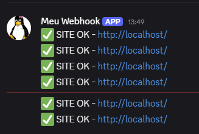
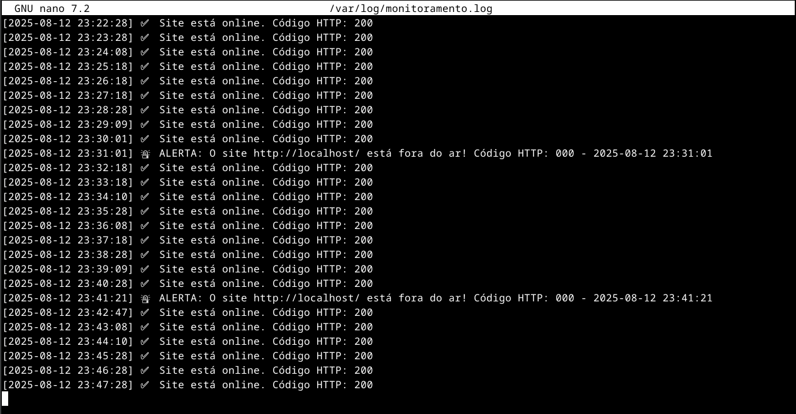

<h1 align="left">
  
  Infraestrutura Local com Monitoramento Automatizado
</h1>

 	

Este projeto implementa um sistema de monitoramento para o **Nginx** no **Debian 12.11**, com **reinicio automático** em caso de falha e **alertas no Discord**.  
Inclui configuração de ambiente, instalação do servidor, criação de scripts, testes e validação.

---

## 🛠 Tecnologias utilizadas

- **Linguagem principal:** Shell Script (Bash)
- **Tecnologias:** Systemd, Nginx, Discord Webhook
- **Sistema:** Debian 12.11 (Linux)

---

## 1️- Preparar o ambiente (Debian 12.11)

1. **Atualizar pacotes**
   ```bash
   sudo apt update && sudo apt upgrade -y
   ```

2. **Verificar a versão do sistema**
   ```bash
   lsb_release -a
   # ou
   cat /etc/os-release
   ```

3. **Instalar pacotes essenciais**
   ```bash
   sudo apt install -y curl nano
   ```

---

## 2️- Instalar e configurar o Nginx

1. **Instalar o Nginx**
   ```bash
   sudo apt install -y nginx
   ```

2. **Ativar e iniciar o serviço**
   ```bash
   sudo systemctl enable nginx
   sudo systemctl start nginx
   ```

3. **Verificar status**
   ```bash
   systemctl status nginx
   ```

4. **Configurar reinicio automático (override)**
   Criar/editar `/etc/systemd/system/nginx.service.d/override.conf`:
   ```ini
   [Unit]
   StartLimitIntervalSec=2min
   StartLimitBurst=10

   [Service]
   Restart=always
   RestartSec=20s
   ```

> Dica: depois de editar qualquer unidade do systemd, rode `sudo systemctl daemon-reload`.

---

## 3️- Script de monitoramento

**Arquivo:** `/usr/local/bin/monitorar_site.sh`  
**Funcao:** checa o site, registra em log (modo normal) e envia alerta pro Discord **apenas quando o estado muda** (UP ↔ DOWN).  
Tambem usa um **arquivo de estado** em `/run/monitor_site.state` para evitar spam de alertas.

```bash
#!/bin/bash

SITE_URL="http://localhost/"
LOG_FILE="/var/log/monitoramento.log"
STATE_FILE="/run/monitor_site.state"
DISCORD_WEBHOOK_URL="COLE_SUA_URL_AQUI"   # substitua

mkdir -p /run
touch "$STATE_FILE"

HTTP_CODE=$(curl -s -o /dev/null -w "%{http_code}" \
  --connect-timeout 1 --max-time 2 "$SITE_URL")
TS=$(date "+%Y-%m-%d %H:%M:%S")

log() {
  echo "[$TS] $1" >> "$LOG_FILE"
}

send_discord() {
  local MSG="$1"
  curl -s -H "Content-Type: application/json" -X POST \
    -d "$(printf '{"content":"%s"}' "$MSG")" \
    "$DISCORD_WEBHOOK_URL" > /dev/null
}

#lê variável para decidir se loga ou não
NOLOG="${MODO_RAPIDO:-0}"

#sempre registra (se não for modo rápido)
if [[ "$HTTP_CODE" =~ ^2|3 ]]; then
  [[ "$NOLOG" = "0" ]] && log "✅ Site está online. Código HTTP: $HTTP_CODE"
else
  [[ "$NOLOG" = "0" ]] && log "🚨 ALERTA: $SITE_URL fora do ar! Código HTTP: $HTTP_CODE - $TS"
fi

#envia alerta só em mudança de estado
if [[ "$HTTP_CODE" =~ ^2|3 ]]; then
  if grep -q "DOWN" "$STATE_FILE"; then
    echo "UP" > "$STATE_FILE"
    send_discord "✅ Site voltou: $SITE_URL (HTTP $HTTP_CODE) - $TS"
  else
    echo "UP" > "$STATE_FILE"
  fi
else
  if ! grep -q "DOWN" "$STATE_FILE"; then
    echo "DOWN" > "$STATE_FILE"
    send_discord "🚨 OFFLINE: $SITE_URL (HTTP $HTTP_CODE) - $TS"
  else
    echo "DOWN" > "$STATE_FILE"
  fi
fi
```

**Permissões e log:**
```bash
sudo chmod +x /usr/local/bin/monitorar_site.sh
sudo touch /var/log/monitoramento.log
sudo chmod 666 /var/log/monitoramento.log
```

> Sobre `/run/monitor_site.state`: fica em tmpfs (volatil). O script recria o arquivo se faltar. Ele guarda **UP** ou **DOWN** para so notificar quando o estado muda.

---

## 4️- Unidades do systemd (serviços e timers)

### 4.1. Modo normal (loga + alerta e roda 1x por minuto)

**/etc/systemd/system/monitoramento.service**
```ini
[Unit]
Description=Healthcheck do site (log + alerta)

[Service]
Type=oneshot
ExecStart=/usr/local/bin/monitorar_site.sh
```

**/etc/systemd/system/monitoramento.timer**
```ini
[Unit]
Description=Timer para monitoramento do site (1/min)

[Timer]
OnCalendar=*-*-* *:*:00
AccuracySec=1s
Unit=monitoramento.service
Persistent=true

[Install]
WantedBy=timers.target
```

### 4.2. Modo rápido (somente alerta e roda a cada 2s)

**/etc/systemd/system/monitoramento-rapido.service**
```ini
[Unit]
Description=Healthcheck rapido (so alerta)

[Service]
Type=oneshot
Environment=MODO_RAPIDO=1
ExecStart=/usr/local/bin/monitorar_site.sh
```

**/etc/systemd/system/monitoramento-rapido.timer**
```ini
[Unit]
Description=Timer rapido (2s) para detectar quedas

[Timer]
OnBootSec=5s
OnUnitActiveSec=2s
AccuracySec=1s
Unit=monitoramento-rapido.service
Persistent=true

[Install]
WantedBy=timers.target
```

**Ativar:**
```bash
sudo systemctl daemon-reload
sudo systemctl enable --now monitoramento.timer
sudo systemctl enable --now monitoramento-rapido.timer
```

---

## 5️- Testes e validação

1. **Ver timers ativos**
   ```bash
   systemctl list-timers | grep monitoramento
   ```

2. **Simular queda do Nginx**
   ```bash
   sudo kill -9 $(pidof nginx)  # derruba
   # o timer rapido deve alertar em ~2s
   ```

3. **Checar log e alerta**
   - Discord: mensagem **OFFLINE** quando cair e **Site voltou** quando voltar  

<p float="left">
  
</p>
   
   - Log local (modo normal grava por minuto):
     ```bash
     tail -f /var/log/monitoramento.log
     ```

<p float="left">
  
</p>

4. **Garantir reinicio do Nginx**
   ```bash
   systemctl status nginx
   journalctl -u nginx -n 50 --no-pager
   ```

---

## 6️- Comandos uteis (resumo)

- `apt update && apt upgrade -y` → atualizar pacotes  
- `apt install -y nginx` → instalar Nginx  
- `systemctl enable/start/status nginx` → gerenciar Nginx  
- `systemctl daemon-reload` → recarregar unidades  
- `systemctl edit nginx` → criar/editar override  
- `systemctl enable --now monitoramento.timer monitoramento-rapido.timer` → ativar timers  
- `systemctl list-timers | grep monitoramento` → listar timers  
- `journalctl -u monitoramento.service -n 50` → logs do healthcheck  
- `journalctl -u nginx -n 50` → logs do Nginx  
- `kill -9 $(pidof nginx)` → simular queda

---

## 📌 Conclusão

Com essa configuracao:
- **Nginx** roda com **reinicio automatico** em caso de falha.  
- O **modo rapido** detecta quedas em segundos e **evita spam** de mensagens (somente em mudancas de estado).  
- O **modo normal** registra log periodico e tambem envia alertas nas mudancas.  
- Ha **rastreabilidade** via `/var/log/monitoramento.log` e **estado** via `/run/monitor_site.state`.

---

### Checklist rápido

- [ ] Substituiu `DISCORD_WEBHOOK_URL` pela sua URL valida  
- [ ] `sudo systemctl daemon-reload` apos criar/editar unidades  
- [ ] `monitoramento.timer` e `monitoramento-rapido.timer` **habilitados**  
- [ ] `override.conf` do Nginx com `RestartSec=20s`  
- [ ] Teste de queda realizado e alertas confirmados
